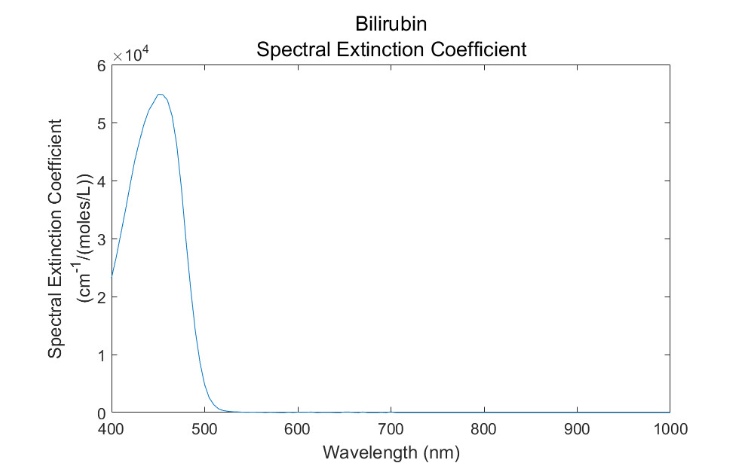
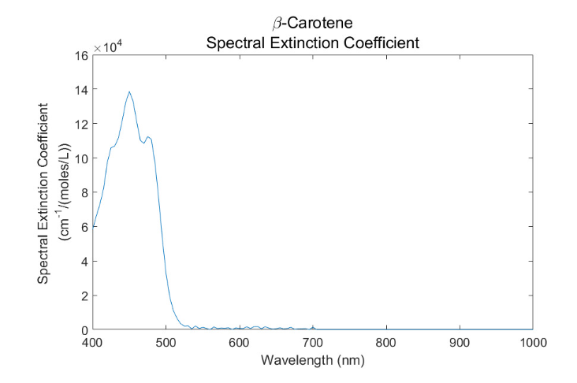
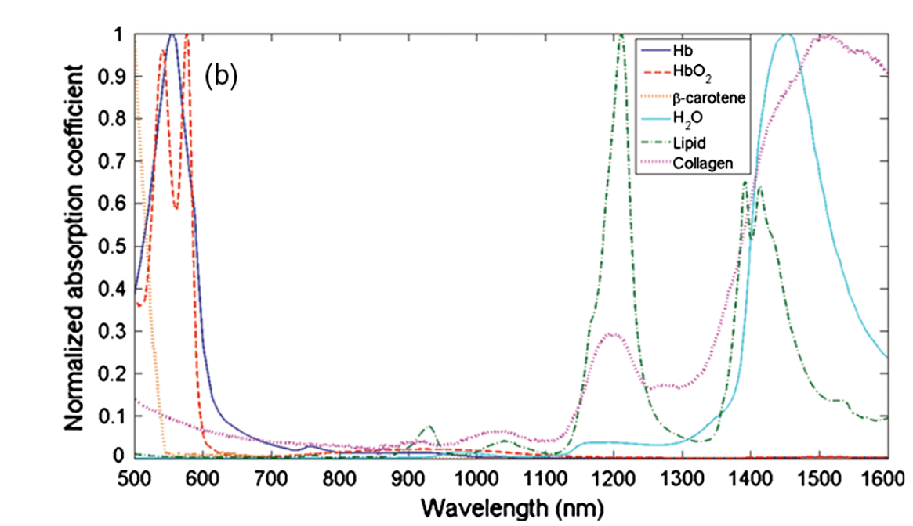

- [Extinction Spectra of Tissue Chromophores](#extinction-spectra-of-tissue-chromophores)
  - [1. Water Spectrum](#1-water-spectrum)
    - [1.1 Water extinition](#11-water-extinition)
    - [1.2 Water absorption coefficient](#12-water-absorption-coefficient)
    - [1.3 Water refractive index](#13-water-refractive-index)
  - [2. Haemoglobin spectra](#2-haemoglobin-spectra)
    - [2.1 Haemoglobin extinction coefficient](#21-haemoglobin-extinction-coefficient)
    - [2.2 Haemoglobin absorption coefficient](#22-haemoglobin-absorption-coefficient)
    - [2.3 Haemoglobin refractive index](#23-haemoglobin-refractive-index)
  - [3. Bilirubin](#3-bilirubin)
    - [3.1 Bilirubin  extinction coefficient](#31-bilirubin--extinction-coefficient)
    - [3.2 Bilirubin  absorption coefficient](#32-bilirubin--absorption-coefficient)
    - [3.1 Bilirubin  refractive coefficient](#31-bilirubin--refractive-coefficient)
  - [4. β-Carotene](#4-β-carotene)
    - [4.1 β-Carotene extinction coefficient](#41-β-carotene-extinction-coefficient)
    - [4.2 β-Carotene absorption coefficient](#42-β-carotene-absorption-coefficient)
    - [4.3 β-Carotene refractive coefficient](#43-β-carotene-refractive-coefficient)
  - [5. Lipids](#5-lipids)
    - [5.1 Lipids extinction coefficient](#51-lipids-extinction-coefficient)
    - [5.2 Lipids absorption coefficient](#52-lipids-absorption-coefficient)
    - [5.3 Lipids refractive coefficient](#53-lipids-refractive-coefficient)
  - [6. Cytochrome Spectra](#6-cytochrome-spectra)

##  Extinction Spectra of Tissue Chromophores
- [Word format](skin_proporties/Concentration.docx)

| **Name of layer**              | **Thinkness,μm** | $$f_{melanin}$$ | $$f_{carotene}$$ | $$f_{lip}$$ | $$f_{blood}$$ | $$f_{water}$$ | Total | $$c_{bilirubin}$$ | $$c_{carotene}$$ |
| ------------------------------ | ---------------- | --------------- | ---------------- | ----------- | ------------- | ------------- | ----- | ----------------- | ---------------- |
| Stratum corneum                | 20               | 0               | 0.45             | 0.2         | 0             | 0.35          | 1     | 0                 | $$2.1∙10^{-4}$$  |
| Living Epidermis (SB + SG+ SS) | 40               | $$K_{melanin}$$ | 0.24             | 0.15        | 0             | 0.5           | 1     | 0                 | $$2.1∙10^{-4}$$  |
| Papilary Dermis                | 180              | 0               | 0.303            | 0.173       | 0.05          | 0.5           | 1.026 | 0.5              | $$7∙10^{-5}?$$   |
| Upper blood net dermis         | 90               | 0               | ?                | 0.173       | 0.2           | 0.6           | 0.8   | 0.5              | $$7∙10^{-5}?$$   |
| Reticular dermis               | 1500             | 0               | 0.125            | 0.173       | 0.04          | 0.7           | 1.038 | 0.5              | $$7∙10^{-5}?$$   |
| Deep blood net dermis          | 100              | 0               | ?                | 0.173       | 0.1           | 0.7           | 0.8   | 0.5              | $$7∙10^{-5}?$$   |

|    Skin type    | Very fair | Fair | Moderately fair | Dark skin |
| :-------------: | :-------: | :--: | :-------------: | :-------: |
| $$K_{melanin}$$ |   0.01    | 0.04 |      0.08       |   0.11    |

$$ μ_a^k (λ)=μ_{a,base} (λ)+f_{blood}^k  [Sμ_{a,HbO_2 } (λ)+(1-S) μ_{a,Hb} (λ)+ μ_{a,bilirubin} (λ)]+f_{water}^k μ_{a,H_2 0} (λ)+f_{melanin}^k ([μ_{a,melanin} (λ)]  or [μ_{a,eum}  (λ)+μ_{a,phe} (λ)])+f_{lip} μ_{a,lip} (λ)+f_{carotene} μ_{a,carotene} (λ)$$

$$S={F_Hb} F_{RBC} Ht $$

|             | Healthy | Anemic |
| ----------- | ------- | ------ |
| $$Ht  $$    | 0.45    | 0.34   |
| $$F_{RBC}$$ | 0.99    | 0.75   |
| $$F_{Hb}$$  | 0.25    | 0.25   |

$$μ_{a,base} (λ)= 7.84×108 ×λ^{-3225} [nm] $$

|  λ   | $$μ_{a,carotene}$$ | $$μ_{a,lip}$$ | $$μ_{a,H_2 0}$$ | $$μ_{a,bilirubin}$$ | $$μ_{a,Hb}$$ | $$μ_{a,HbO_2 }$$ |
| :--: | :----------------: | :-----------: | :-------------: | :-----------------: | :----------: | :--------------: |
| 1310 |      in graph      |   in graph    | 1.5608(1309.9)  |    almost zero?     | approximate  |   approximate    |

In non-scattering materials, the refractive index spectrum is crucial. However, with the predominance of scattering in the fabric, the influence of the refractive index is rather a second- or third-order effect, primarily affecting the reflection coefficient of the mirror surface. Thus, no significant effort was made to measure the refractive index of the tissue in vivo.

| **Name of layer**              | $$ n', λ = 600nm $$ | $$ n', λ = 1310nm $$ |
| ------------------------------ | :-----------------: | :------------------: |
| Stratum corneum                |        1.53         |      in search       |
| Living Epidermis (SB + SG+ SS) |        1.34         |      in search       |
| Papilary Dermis                |         1.4         |      in search       |
| Upper blood net dermis         |        1.39         |      in search       |
| Reticular dermis               |         1.4         |      in search       |
| Deep blood net dermis          |        1.39         |      in search       |

<!-- 
 -->

.png)
- [refractive index (400-1000 nm)](refractive(400-1000nm).pdf)
  
<!-- 
 -->

### 1. Water Spectrum
#### 1.1 Water extinition
**Prof. Tachtsidis**
- [extinction spectrum of pure water (650 nm - 924 nm)](spectra/water740_840_vhollis_2001_37.txt)
- [temperature coefficient of water (OD per cm per degree C; 650 nm - 924 nm)](spectra/water740_840_vhollis_2001_coeff.txt)
- [extinction spectrum of pure water (900 nm - 1050 nm)](spectra/water970_vhollis_2001_37.txt)
- [temperature coefficient of water (OD per cm per degree C; 900 nm - 1050 nm)](spectra/water970_vhollis_2001_coeff.txt)
#### 1.2 Water absorption coefficient
**[3]**
- [absorption coefficient sea water, and heavy water (400 nm - 790 nm)](data/sullivan63.txt)
- [absorption coefficient water (1232 nm - 20000 nm)](data/wieliczka89.txt)
- [absorption coefficient water and ice spheres (200 nm - 10000	nm)](data/irvine68.txt)
- [absorption coefficient water (1000 nm - 10^9 nm)](data/zolotarev69.txt)
- [absorption coefficient water (200 nm - 90000 nm)](data/hale73.txt)
- [absorption coefficient water (690 nm - 2632 nm)](data/palmer74.txt)
#### 1.3 Water refractive index
**[3]**
- [refractive index water (real and imaginary) (10^-2 mkm - 10^7 mkm)](data/segelstein81_index.txt)
- [refractive index water and ice (real) (10^-2 mkm - 10^7 mkm)](data/segelstein81_index.txt)

### 2. Haemoglobin spectra
#### 2.1 Haemoglobin extinction coefficient
**[3]**
- [extinction coefficient haemoglobin and oxy-hemoglobin (250 nm - 1000 nm)](data/Tabulated%20Molar%20Extinction%20Coefficient%20for%20Hemoglobin%20in%20Water.txt)

**[18]**
need to check the dimension
- [extinction coefficient haemoglobin and oxy-hemoglobin (1000 nm - 2000 nm)](../hemoglobin%201000-2000nm%20(18).pdf)

**Prof. Tachtsidis**
- [extinction coefficient of adult haemoglobin (450 nm - 630 nm)](spectra/z_adult_hb_450_630.txt)
- [extinction coefficient of adult haemoglobin (600 nm - 800 nm)](spectra/z_adult_hb_600_800.txt)
- [extinction coefficient of adult oxyhaemoglobin (450 nm - 630 nm)](spectra/z_adult_hbo2_450_630.txt)
- [extinction coefficient of adult oxyhaemoglobin (600 nm - 800 nm)](spectra/z_adult_hbo2_600_800.txt)
- [extinction coefficient of adult carboxyhaemoglobin (450 nm - 630 nm)](spectra/z_adult_hbco_450_630.txt)
- [extinction coefficient of adult carboxyhaemoglobin (600 nm - 800 nm)](spectra/z_adult_hbco_600_800.txt)
- [extinction coefficient of adult haemiglobin (450 nm - 630 nm)](spectra/z_adult_hi_450_630.)
- [extinction coefficient of adult haemiglobin (600 nm - 800 nm)](spectra/z_adult_hi_600_800.txt)
- [extinction coefficient of adult haemiglobin (700 nm-1000 nm)](spectra/z_adult_hi_700_1000.txt)
- [extinction coefficient of adult haemiglobincyanide (450 nm - 630 nm)](spectra/z_adult_hicn_450_630.txt)
- [extinction coefficient of adult haemiglobincyanide (600 nm - 800 nm)](spectra/z_adult_hicn_600_800.txt)
- [extinction coefficient of adult sulfhaemiglobin (450 nm - 630 nm)](spectra/z_adult_shb_450_630.txt)
- [extinction coefficient of adult sulfhaemiglobin (600 nm - 800 nm)](spectra/z_adult_shb_600_800.txt)
- [extinction coefficient of fetal haemoglobin (450 nm - 630 nm)](spectra/z_fetal_hb_450_630.txt)
- [extinction coefficient of fetal haemoglobin (600 nm - 800 nm)](spectra/z_fetal_hb_600_800.txt)
- [extinction coefficient of fetal oxyhaemoglobin (450 nm - 630 nm)](spectra/z_fetal_hbo2_450_630.txt)
- [extinction coefficient of fetal oxyhaemoglobin (600 nm - 800 nm)](spectra/z_fetal_hbo2_600_800.txt)
- [extinction coefficient of fetal carboxyhaemoglobin (450 nm - 630 nm)](spectra/z_fetal_hbco_450_630.txt)
- [extinction coefficient of fetal carboxyhaemoglobin (600 nm - 800 nm)](spectra/z_fetal_hbco_600_800.txt)
- [extinction coefficient of fetal haemiglobin (450 nm - 630 nm)](spectra/z_fetal_hi_450_630.txt)
- [extinction coefficient of fetal haemiglobin (600 nm - 800 nm)](spectra/z_fetal_hi_600_800.txt)
#### 2.2 Haemoglobin absorption coefficient
**Prof. Tachtsidis**
- [absorption spectrum of haemoglobin (650 nm - 1042 nm)](spectra/hb02.txt)
- [absorption spectrum of oxyhaemoglobin (650 nm - 1042 nm)](spectra/hb.txt)

#### 2.3 Haemoglobin refractive index
**[19]**
- [refractive index haemoglobin and blood (480 nm - 1550 nm)](../hemoglobin%20refractive-index%20480%20-1550%20nm%20(19).pdf)
### 3. Bilirubin 
#### 3.1 Bilirubin  extinction coefficient
- [extinction spectrum of Bilirubin  (220 nm - 700 nm)](data/119-abs.txt)

- [source](https://embeddedcomputing.com/application/healthcare/how-to-choose-the-optimal-wavelength-for-your-biosensor-application)
#### 3.2 Bilirubin  absorption coefficient
***In searh***
#### 3.1 Bilirubin  refractive coefficient
***404***
### 4. β-Carotene
#### 4.1 β-Carotene extinction coefficient
- [extinction spectrum of β-Carotene (220 nm - 700 nm)](data/041-abs.txt)

#### 4.2 β-Carotene absorption coefficient

- [source](https://sci-hub.ru/10.1117/1.JBO.20.3.030901)
#### 4.3 β-Carotene refractive coefficient
***404***
### 5. Lipids
#### 5.1 Lipids extinction coefficient
***In searh***
#### 5.2 Lipids absorption coefficient
.png)
.png)
.png)
#### 5.3 Lipids refractive coefficient
***404***
### 6. Cytochrome Spectra
**Prof. Tachtsidis**
- [difference extinction spectrum of cytochrome oxidase (650 nm - 986 nm)](spectra/cytoxidase_diff_odmMcm.txt)

- [extinction spectrum of oxidised cytochrome c (500 nm - 650 nm)](spectra/lubber_vis_cytc_ox.txt)
- [extinction spectrum of reduced cytochrome c (500 nm - 650 nm)](spectra/lubber_vis_cytc_red.txt)
- [extinction spectrum of oxidised cytochrome b (505 nm - 640 nm)](spectra/lubber_vis_cytb_ox.txt)
- [extinction spectrum of reduced cytochrome b (505 nm - 640 nm)](spectra/lubber_vis_cytb_red.txt)
- [extinction spectrum of oxidised cytochrome oxidase (500 nm - 630 nm)](spectra/lubber_vis_cytcox_ox.txt)
- [extinction spectrum of reduced cytochrome oxidase (500 nm - 630 nm)](spectra/lubber_vis_cytcox_red.txt)

- [difference extinction spectrum of cytochrome c (380 nm - 710 nm) c ](spectra/springett-cooper95_vis_cytc_diff.txt)
- [difference extinction spectrum of cytochrome b (541 nm - 576 nm) d ](spectra/rich_vis_cytb_diff_1nmshifted.txt)
- [difference extinction spectrum of cytochrome c oxidase (350 nm - 700 nm) e ](spectra/lubber_vis_cytc_ox.txt)
- [extinction spectrum of oxidised cytochrome c (500 nm - 1000 nm) f ](spectra/cooper%20pig%20c%20oxidised.txt)
- [extinction spectrum of reduced cytochrome c (500 nm - 1000 nm) f ](spectra/cooper%20pig%20c%20reduced.txt)
- [extinction spectrum of oxidised cytochrome b (402 nm - 997 nm) g ](spectra/cope%20cyt%20b%20oxidised.txt)
- [extinction spectrum of reduced cytochrome b (402 nm - 997 nm) g ](spectra/cope%20cyt%20b%20reduced.txt)
- [extinction spectrum of oxidised cytochrome c oxidase (520 nm - 999 nm) h ](spectra/moody%20cyt%20aa3%20oxidised.txt)
- [extinction spectrum of reduced cytochrome c oxidase (520 nm - 999 nm) h ](spectra/moody%20cyt%20aa3%20reduced.txt)

